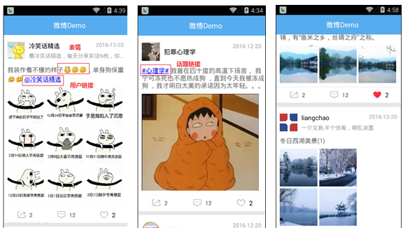

## 内容摘要

该控件能够应用于内容资讯展示的功能模块中，如：腾讯和新浪微博的微博列表，微信朋友圈及其它社交类应用的好友动态展示列表等；实现了类似腾讯微博的微博列表展示功能，包含微博文本内容，表情，图片，话题和用户可点超链接等（请参见如下效果图）。该功能在实际项目开发中非常常见，除微博应用外，微信的朋友圈，陌陌、QQ空间的好友动态等也都有类似功能；

1. RecyclerView使用和嵌套问题
2. 动态设置图片网格宽高
3. 正则表达式的使用
4. Linkify实现自定义超链接
5. TextView富文本显示
6. 点赞动画渐变动画效果

## 效果图



## 列表的item布局文件

```xml
<?xml version="1.0" encoding="utf-8"?>
<LinearLayout
    xmlns:android="http://schemas.android.com/apk/res/android"
    android:layout_width="match_parent"
    android:layout_height="wrap_content"
    android:layout_marginBottom="5dp"
    android:background="@color/white"
    android:descendantFocusability="blocksDescendants"
    android:orientation="vertical">

    <RelativeLayout
        android:layout_width="match_parent"
        android:layout_height="60dp"
        android:layout_marginTop="10dp"
        android:paddingLeft="10dp"
        android:paddingRight="10dp">

        <ImageView
            android:id="@+id/iv_avatar"
            android:layout_width="45dp"
            android:layout_height="45dp"
            android:layout_centerVertical="true"
            android:background="#11000000"
            android:scaleType="centerCrop"/>

        <LinearLayout
            android:layout_width="match_parent"
            android:layout_height="wrap_content"
            android:layout_centerVertical="true"
            android:layout_marginLeft="10dp"
            android:layout_toRightOf="@id/iv_avatar"
            android:orientation="vertical">

            <TextView
                android:id="@+id/tv_user"
                android:layout_width="wrap_content"
                android:layout_height="wrap_content"
                android:layout_marginRight="120dp"
                android:text="用户名"
                android:textColor="@color/black"
                android:textSize="16sp"/>

            <TextView
                android:id="@+id/tv_user_introduction"
                android:layout_width="match_parent"
                android:layout_height="wrap_content"
                android:layout_marginTop="5dp"
                android:singleLine="true"
                android:text="用户相关介绍"
                android:textColor="@color/item_text_secondary"
                android:textSize="14sp"/>
        </LinearLayout>

        <TextView
            android:id="@+id/tv_date"
            android:layout_width="wrap_content"
            android:layout_height="wrap_content"
            android:layout_alignParentRight="true"
            android:layout_marginTop="5dp"
            android:text="0000-00-00"
            android:textColor="@color/item_text_secondary"
            android:textSize="14sp"/>

    </RelativeLayout>

    <TextView
        android:id="@+id/tv_content"
        android:layout_width="match_parent"
        android:layout_height="wrap_content"
        android:layout_marginBottom="10dp"
        android:layout_marginLeft="10dp"
        android:layout_marginTop="5dp"
        android:text="这是微博内容...这是微博内容..."
        android:textColor="@color/item_text_main"
        android:textSize="16sp"/>

    <!--显示微博图片-->
    <android.support.v7.widget.RecyclerView
        android:id="@+id/rv_weibo_images"
        android:layout_width="match_parent"
        android:layout_height="wrap_content"
        android:layout_marginBottom="10dp"
        android:layout_marginLeft="10dp"
        android:layout_marginRight="10dp"
        android:listSelector="@color/transparent"
        android:visibility="gone"/>

    <View
        android:layout_width="match_parent"
        android:layout_height="1px"
        android:background="@color/activity_bg"/>

    <LinearLayout
        android:layout_width="match_parent"
        android:layout_height="40dp"
        android:orientation="horizontal">

        <FrameLayout
            android:layout_width="0dp"
            android:layout_height="match_parent"
            android:layout_weight="1"
            android:clickable="true">

            <TextView
                android:id="@+id/tv_forward"
                android:layout_width="wrap_content"
                android:layout_height="wrap_content"
                android:layout_gravity="center"
                android:drawableLeft="@drawable/selector_btn_share"
                android:textColor="@color/item_text_secondary"
                android:drawablePadding="5dp"
                android:gravity="center"
                android:text="0"/>

        </FrameLayout>

        <FrameLayout
            android:layout_width="0dp"
            android:layout_height="match_parent"
            android:layout_weight="1"
            android:clickable="true">

            <TextView
                android:id="@+id/tv_comment"
                android:layout_width="wrap_content"
                android:layout_height="wrap_content"
                android:layout_gravity="center"
                android:drawableLeft="@drawable/selector_btn_comment"
                android:textColor="@color/item_text_secondary"
                android:drawablePadding="5dp"
                android:gravity="center"
                android:text="0"/>

        </FrameLayout>

        <LinearLayout
            android:layout_width="0dp"
            android:layout_height="match_parent"
            android:layout_weight="1"
            android:gravity="center"
            android:clickable="true">

            <CheckBox
                android:id="@+id/cb_like"
                android:layout_width="40dp"
                android:layout_height="40dp"
                android:layout_gravity="center"
                android:button="@color/transparent"
                android:checked="false"
                android:drawableLeft="@drawable/selector_btn_prize"
                android:drawablePadding="5dp"
                android:background="@color/transparent"
                android:textColor="@color/item_text_secondary"
                android:gravity="center"/>

            <TextView
                android:id="@+id/tv_like"
                android:text="0"
                android:textColor="@color/item_text_secondary"
                android:layout_width="wrap_content"
                android:layout_height="wrap_content"/>

        </LinearLayout>

    </LinearLayout>

</LinearLayout>
```

item中的RecyclerView用于显示0-9张图片，根据服务器返回的图片数量不同显示的行列数和图片的大小也不同，需要动态设置，由于这个列表是RecyclerView，item中也使用了RecyclerView，这就产生了RecyclerView的嵌套

id为tv_content的TextView用于显示内容，内容中包含了表情图片和超链接

## json数据格式

```json
{
	"result":true,
	"weibo":[
		{
			"avatar":"avatar_01",
			"comment":5,
			"content":"我装作看不懂的样子[呲牙][偷笑][偷笑]，单身狗保重 [再见][再见] @冷笑话精选",
			"date":1489223423501,
			"forward":8,
			"imageUrls":[
				"pic_1",
				"pic_2",
				"pic_3",
				"pic_4",
				"pic_5",
				"pic_6",
				"pic_7",
				"pic_8",
				"pic_9"
			],
			"like":10,
			"user_introduction":"最冷笑话精选，每天分享笑话N枚，你的贴身开心果。",
			"username":"冷笑话精选"
		}
     ]
}
```

对应的实体类

```java
public class WeChat {

    public boolean result;
    public List<WeiboEntity> weibo;

    public static class WeiboEntity {
        public String       avatar;
        public int          comment;
        public String       content;
        public long         date;
        public int          forward;
        public int          like;
        public String       user_introduction;
        public String       username;
        public List<String> imageUrls;
    }
}
```
## 动态设置图片宫格数

根据图片的数量，动态设置RecyclerView的列数和宽度

- 如果图片数量为0，则隐藏RecyclerView
- 如果图片数量为1，RecyclerView列数设为1列，宽度设为WRAP_CONTENT
- 如果图片数量为4，RecyclerView列数设为2列，宽度设为两个图片宫格的宽度
- 其它，RecyclerView列数设为3列，宽度设为MATCH_PARENT

```java
// 刷新item布局中子控件的显示
    @Override
    protected void onRefreshView(WeChat.WeiboBean bean, int position) {
        // 显示用户名
        tvUser.setText(bean.getUsername());

        // 显示用户介绍
        if (TextUtils.isEmpty(bean.getUser_introduction())) {
            tvUserIntroduction.setVisibility(View.GONE);
        } else {
            tvUserIntroduction.setVisibility(View.VISIBLE);
            tvUserIntroduction.setText(bean.getUser_introduction());
        }
        // 显示头像
        int imageResId = Global.getResId(context, bean.getAvatar());
        ivAvatar.setBackgroundResource(imageResId);

        // 微博内容
        // tvContent.setText(bean.getContent());
        EmojiUtil.setText(tvContent, bean.getContent());
        LinkifyUtil.addCustomLink(tvContent);
        LinkifyUtil.addCustomLink2(tvContent);

        // 发表时间
        tvDate.setText(Global.formatDate(bean.getDate()));

        // 显示微博图片
        int imageCount = bean.getImageUrls() == null
                ? 0 : bean.getImageUrls().size();
        if (imageCount == 0) {      // 没有微博图片
            rvWeiboImages.setVisibility(View.GONE);
        } else {    // 有微博图片
            rvWeiboImages.setVisibility(View.VISIBLE);
            imageAdapter.setDatas(bean.getImageUrls()); // 刷新图片显示

            // 动态的指定图片宫格的宽高和RecyclerView的宽度
            // 1张图片 -> 1列
            // 4张图片 -> 2列
            // 其它    -> 3列
            ViewGroup.LayoutParams param = rvWeiboImages.getLayoutParams();
            if (imageCount == 1) {
                layoutManager.setSpanCount(1);
                param.width = ViewGroup.LayoutParams.WRAP_CONTENT;
            } else if (imageCount == 4) {
                layoutManager.setSpanCount(2);
                // 两个图片宫格的宽度
                param.width = Global.getGridWidth() * 2;
            } else {        // 3列
                layoutManager.setSpanCount(3);
                param.width = ViewGroup.LayoutParams.MATCH_PARENT;
            }
        }
    }
```

## 动态设置图片的大小

- 1张图片，宫格的宽高为图片的宽高
- 其它情况，宫格的宽高为屏幕宽度的三分之一

```java
 	// 刷新item子控件的显示
    @Override
    protected void onRefreshView(String imagePath, int position) {
        // 动态设置图片宫格的宽高
        // 1张图片  ->   宫格的宽高为图片的宽高
        // 其它情况  ->  宫格的宽高为Global.getGridWidth()
        ViewGroup.LayoutParams param = super.itemView.getLayoutParams();
        if (super.adapter.getItemCount() == 1) {    // 一张图片
            // 图片资源id
            int imageResId = Global.getResId(context, imagePath);
            Bitmap bitmap = BitmapFactory.decodeResource(
                    context.getResources(), imageResId);
            // 指定宫格的宽高为图片的宽高
            param.width = bitmap.getWidth();
            param.height = bitmap.getHeight();
            // 显示图片
            ivImage.setBackgroundResource(imageResId);
        } else {    // 多张图片
            // 显示宫格图片
            int imageResId = Global.getResId(context, imagePath);
            ivImage.setBackgroundResource(imageResId);

            param.width = Global.getGridWidth();    // 指定宫格图片的宽
            param.height = Global.getGridWidth();
        }
    }
```

## TextView富文本显示

显示文本中的表情，把文本中如`[呲牙][偷笑][偷笑]`的文字替换成表情图片，实现TextView的富文本显示（图文混排）。需要用正则去匹配文本中是否包含表情，匹配成功，表示文本中包含表情，用ImageSpan封装表情图片，再ImageSpan将设置给SpannableString，把文本中的表示表情的文字替换掉，最后将SpannableString设置给TextView即可。

正则参考：

```
[高兴]    \\[([A-Za-z\u4E00-\u9FA5]+)\\]
@用户     \\@([A-Za-z0-9\u4E00-\u9FA5]+)
#话题#    \\#([A-Za-z0-9\u4E00-\u9FA5]+)\\#
```

```java
public class EmojiUtil {

    /** 显示文本和表情 */
    public static void setText(TextView textView, String text) {
        Context context = textView.getContext();
        Resources resources = context.getResources();
        SpannableString ss = new SpannableString(text);

        // 正则表达式： [高兴]
        Pattern p = Pattern.compile("\\[([A-Za-z\u4E00-\u9FA5]+)\\]");
        Matcher matcher = p.matcher(ss);
        while (matcher.find()) {
            // 匹配到一个表情字符串
            String emoji = matcher.group();
            // 过滤非表情符，比如： [xxx]
            if (EMOJI_DATAS.containsKey(emoji)) {   // 是表情才处理
                // System.out.println("----------" + emoji);
                // 指定了一张图片
                Bitmap bitmap = BitmapFactory.decodeResource(resources, EMOJI_DATAS.get(emoji));
                bitmap = Global.createBitmap(bitmap, Global.dp2px(20));     // 图片的宽高为20dp
                ImageSpan span = new ImageSpan(context, bitmap, ImageSpan.ALIGN_BOTTOM);
                int start = matcher.start();
                int end = matcher.end();
                ss.setSpan(span, start, end, 0);
            }
        }
        textView.setText(ss);
    }

    private static final HashMap<String, Integer> EMOJI_DATAS = new HashMap<String, Integer>();

    static {
        EMOJI_DATAS.put("[微笑]", R.drawable.smiley_0);
        ...
    }
}
```
## 自定义超链接

关于TextView 网页，电话，邮箱的自动识别。

```
<TextView
	...
	android:text=" 电话 13609000000 邮箱 xxx@163.com 网址 http://www.google.com " />
```

添加自定义超链接，把内容中如`@冷笑话精选`、`#编程#`、`#讲故事#`的文本显示为超链接，高亮显示并支持点击。先使用Linkify.MatchFilter 匹配过滤器过滤内容中的超链接，再调用Linkify.addLinks()为TextView添加超链接

```java
public class LinkifyUtil {

    /**
     * 添加自定义超链接
     */
    public static void addCustomLink(TextView textView) {
        // @用户:
        Pattern pattern = Pattern.compile("\\@([A-Za-z0-9\u4E00-\u9FA5]+)\\.?");
        // http://www.qq.com/path?uid=1&username=xx
        String scheme = "weibo://user?uid=";

        // 匹配过滤器
        Linkify.MatchFilter matchFilter = new Linkify.MatchFilter() {
            @Override
            public boolean acceptMatch(CharSequence s, int start, int end) {
                String text = s.subSequence(start, end).toString();
                // System.out.println("----text: " + text);
                if (text.endsWith(".")) { // 邮箱，不需要匹配
                    return false;
                } else {
                    return true;    // 返回true会显示为超链接
                }
            }
        };
        Linkify.TransformFilter transformFilter = null;
        Linkify.addLinks(textView, pattern, scheme, matchFilter, transformFilter);
    }

    public static void addCustomLink2(TextView textView) {
        // @用户:
        Pattern pattern = Pattern.compile("\\#([A-Za-z0-9\u4E00-\u9FA5]+)\\#");
        // http://www.qq.com/path?uid=1&username=xx
        String scheme = "weibo://topic?uid=";
        // 匹配过滤器
        Linkify.MatchFilter matchFilter = new Linkify.MatchFilter() {
            @Override
            public boolean acceptMatch(CharSequence s, int start, int end) {
                String text = s.subSequence(start, end).toString();
                System.out.println("----text: " + text);
                return true;
            }
        };
        Linkify.TransformFilter transformFilter = new Linkify.TransformFilter() {
            @Override
            public String transformUrl(Matcher match, String url) {
                return match.group(1);
            }
        };
        Linkify.addLinks(textView, pattern, scheme, matchFilter, transformFilter);
    }
}
```
点击自定义的链接后，点击超链接后会出错。 因为没有找到Activity可以处理发起的Intent, 需要定义两个Activity来接收意图中的参数。

在清单文件中配置以上Activity，给Activity设置action、category、data

```xml
<!--点击用户链接时，要调起该Activity-->
<activity android:name=".ui.activity.UserActivity">
    <intent-filter>
        <action android:name="android.intent.action.VIEW"/>
        <category android:name="android.intent.category.DEFAULT"/>
        <data android:scheme="weibo" android:host="user"/>
    </intent-filter>
</activity>
<activity android:name=".ui.activity.TopicActivity">
    <intent-filter>
        <action android:name="android.intent.action.VIEW"/>
        <category android:name="android.intent.category.DEFAULT"/>
        <data android:scheme="weibo" android:host="topic"/>
    </intent-filter>
</activity>
```
## 点赞动画

在MainActivity的布局文件中，有一个TextView，是用来执行点赞后的+1的动画（向上平移，透明度变小，放大）。 该控件开始时隐藏，执行点赞动画时，注意不是列表项中的控件执行动画。

```java
// WeiboHolder.java
cbLike.setOnCheckedChangeListener(new CompoundButton.OnCheckedChangeListener() {
    @Override
    public void onCheckedChanged(CompoundButton buttonView, boolean isChecked) {
        if (isChecked) {
			// 获取当前点击控件相对于窗口的所在位置
            int[] locations = new int[2];
            tvLike.getLocationInWindow(locations);
            ((MainActivity) context).animateUp(locations);
        }
    }
});
```

```java
public void animateUp(int[] locations) {
    // 减去状态栏高度24dp
    int currentY = locations[1] - Global.dp2px(24);
    tvLike.setVisibility(View.VISIBLE);
    tvLike.setTranslationX(locations[0]);
    tvLike.setTranslationY(currentY);
    tvLike.setScaleY(1);
    tvLike.setScaleX(1);
    tvLike.setAlpha(1f);

    // 往上移动30dp
    int top = currentY - Global.dp2px(30);
    tvLike.animate().alpha(0).translationY(top)
            .setInterpolator(new DecelerateInterpolator())
            .scaleX(1.2f).scaleY(1.2f).setDuration(1000);
}
```